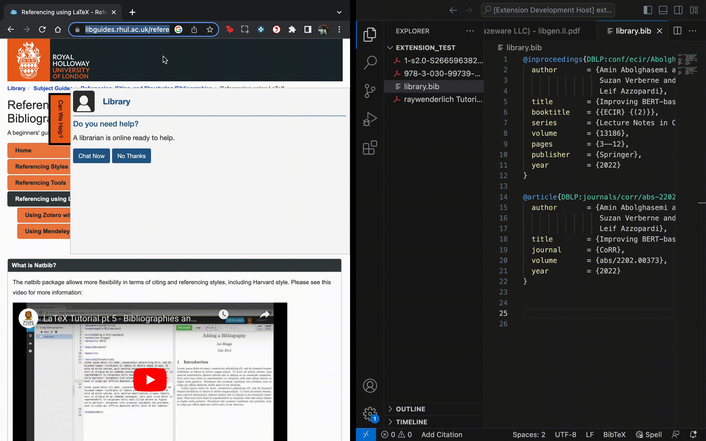

# BibTeX Manager
The BibTeX Manager is a helpful extension for Visual Studio Code that streamlines the process of fetching and managing BibTeX references for research papers and websites. It simplifies the retrieval of BibTeX entries, allowing you to effortlessly generate citations with just a few clicks.

## Features
### Fetching Paper-BibTex
Copy the title of any research paper to your clipboard and click the "Add Citation" button. The BibTeX Manager automatically searches popular databases like DBLP and Scholar Archive, retrieves the corresponding BibTeX entry, and adds it to your specified BibTeX file.

### Generating BibTex for websites
 Need to cite a website? Copy the URL of a webpage and click the "Add Citation" button. The extension attempts to fetch the webpage's title and generate a BibTeX entry. If the title cannot be automatically retrieved due to redirects or other limitations, you can manually add the title inside the generated .bib file. 

## Customizable File Path
By default, the fetched BibTeX entries are saved to a file named `library.bib`. However, you have the flexibility to customize the file path and filename to suit your needs. Specify your desired location and file name in the extension settings to keep your bibliography organized.

## Release Notes
### 0.0.1

Initial release of the BibTex Fetcher extension. 

### 0.0.2 

Minor fixes

### 0.1.0

Added automatic BibTex generation for websites.

### 0.2.0 

Added the (long needed) option to use a custom filename.

### 0.3.0 

There was an issue with DBLP. Thats why i changed it so you now can choose the engine which is used to look up the citation in the settings. 

