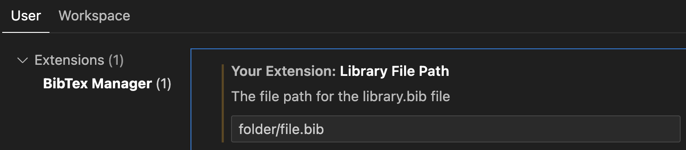

# BibTeX Manager
The BibTeX Manager is a helpful extension for Visual Studio Code that streamlines the process of fetching and managing BibTeX references for research papers and websites. It simplifies the retrieval of BibTeX entries, allowing you to effortlessly generate citations with just a few clicks.

## Features
### Fetching Paper-BibTeX
With release 1.0 we improved the usability by adding a visual interface for the BibTeX manager. 

1. Copy the title of any research paper to your clipboard.
2. Click on the "BibTeX Manager" icon in the activity bar (on the left).
3. Paste your Title and click on "Search".
4. Add the correct papers to your library.

*The "Add Citation" button form previous versions will only work once you clicked on the "BibTeX Manager" icon in the activity bar to start the extension. We are working on fixing that. Clicking "Add Citation" will automatically search for the text thats in your clipboard.*
<!--  -->
<!-- <video src="res/addCitation.mp4" autoplay loop muted playsinline title="Add BibTeX"></video> -->
 <!-- by https://www.xconvert.com -->

### Generating BibTeX for websites
Version 1.0 does not support generating BibTeX for websites yet. We removed the feature from the pre-release since it was incomplete.

## Customizable File Path
By default, the fetched BibTeX entries are saved to a file named `library.bib`. However, you have the flexibility to customize the file path and filename to suit your needs. Specify your desired location and file name in the extension settings to keep your bibliography organized. 

*If you are working with differing project structures you should use the workspace settings.*

## Release Notes
### 0.0.1

Initial release of the BibTeX Fetcher extension. 

### 0.0.2 

Minor fixes

### 0.1.0

Added automatic BibTeX generation for websites.

### 0.2.0 

Added the (long needed) option to use a custom filename.

### 0.3.0 

There was an issue with DBLP. Thats why i changed it so you now can choose the engine which is used to look up the citation in the settings. 

### 1.0.0
In this first mayor update we changed the following:
1. Introduced a visual interface when looking up and adding BibTeX.
2. Added the option to choose the required citation out of a list of papers. 
3. Added [SemanticScholar](https://www.semanticscholar.org) as the backend.
4. Bug fixes and rework of codebase.
5. Added new icon designed by [Ngoc-Han Le](https://www.linkedin.com/in/ngoc-han-le/).

This release should greatly improve the reliability of the BibTeX manager Extension. Happy writing!

